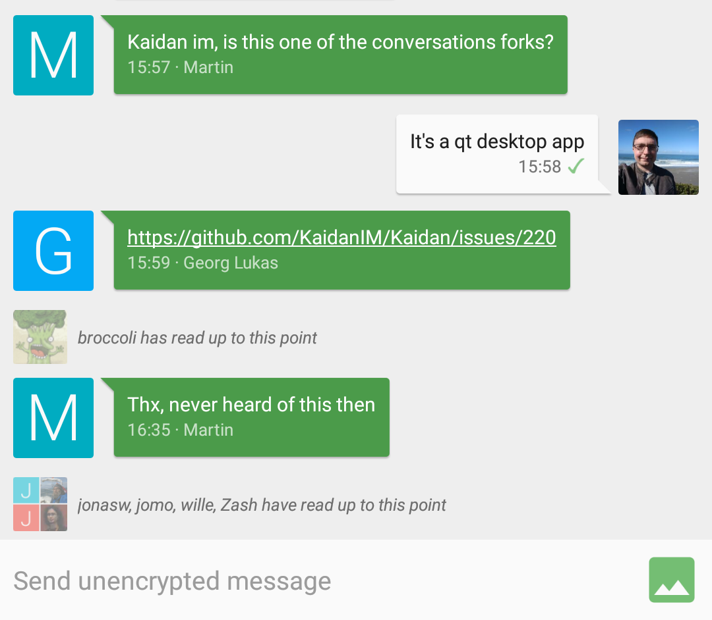
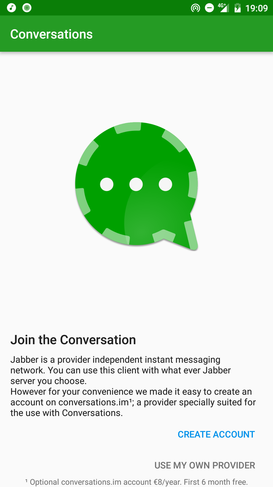
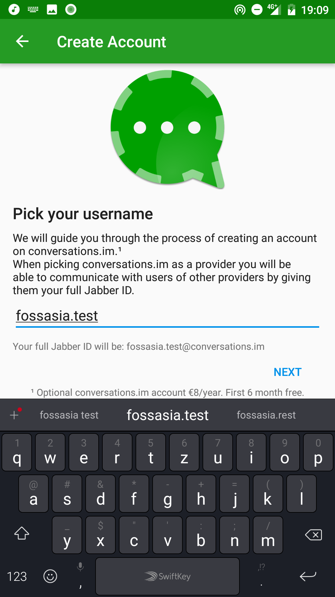
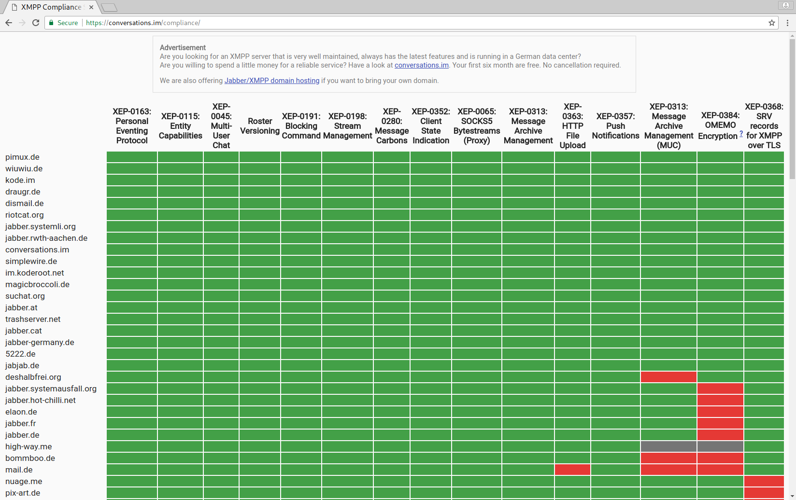

## Federated Instant Messaging with Jabber/XMPP 
[Daniel Gultsch](https://gultsch.de)

<small>March 25th 2018 @ FOSSASIA</small

---

WhatsApp, WeChat, Telegram, Line, Hangouts, Viber, Signal, Facebook Messenger, Threema, HipChat, Slack, Skype, RocketChat

ICQ, QQ, MSN, Yahoo

---

### XMPP
* Extensible Messaging and Presence Protocol 
* IETF working group since 2002
* Extensions *published* by the XSF

---

### Jabber vs XMPP
* Federated, provider independent IM
* Free choice of client and server provider
* Users are identified *username@domain.tld*

---

### (Past) users of XMPP
* Google †
* Slack (Frontend only) †
* HipChat †
* various government agencies

---

### pre 2014
* no widespread implementations for:
 * mobile support
 * multiple devices
 * file transfer
* outdated UI

---

---

---

---

---

---

---

2018
* as good or bad as everything else
* requires compliant server

---

---

### Motivation
* Users: Provider independent instant messaging
* Get developers to use XMPP for their own projects

---

### Getting started
* Users
 * [Conversations](https://conversations.im) (Android)
 * [Gajim](https://gajim.org) (Windows / Linux)
 * [ChatSecure](https://chatsecure.org) (iOS)
* Developers
 * XMPP Library in nearly every language
 * Server: ejabberd

---

## Questions?
[gultsch.de](https://gultsch.de)

[@iNPUTmice](https://twitter.com/iNPUTmice)

