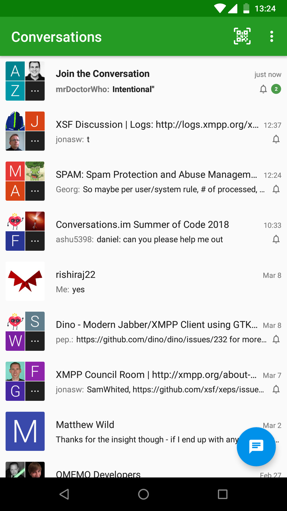

# Vom Hobby zum Beruf
### Open Source darf auch ’was kosten
[Daniel Gultsch](https://gultsch.de)

<small>6. November 2018 @ TU Dresden</small

---

## Über mich
* 10+ Jahre Freiberufler
* Abgebrochenes Studium
* 5 Jahre »Vollzeit Open Source«

Note: Ich heiße Daniel Gultsch, komme ursprünglich aus Köln, hab in Aachen studiert - allerdings nicht zu Ende - und wohne zur Zeit in Dresden.
Ich bin seit über 10 Jahren als Freiberufler tätig. Vor 5 Jahren habe ich angefangen Conversations zu entwickeln.
Conversations war mein erstes richtige Open Source Projekt.
Ich erwähne das mit dem Studium nur weil ich mit Conversations angefangen habe als ich eingeschrieben war und im Studentenwohnheim gewohnt habe. Die Information hilft euch später ein paar Dinge von denen ich erzähle in Kontext zu setzen.

---

## Conversations
* Android Instant Messaging Client
* Jabber/XMPP (Anbieterunabhängig, E2EE)
* 25k Verkäufe
* Tooling: Compliance Tester, Uptime Monitor

Note: Kurz ein paar Worte zu Conversations. Conversations ist eine Instant Messaging App für Android und eine Alternative zu WhatsApp, Signal, Telegram und so weiter. Der unique selling point ist das Conversations im Gegensatz zu den erwähnten Apps Anbieterunabhängig ist. Ich kann mir als Nutzer also aussuchen wer den Server betreiben soll und trotzdem noch mit Leuten chatten die auf anderen Servern sind. Im Grunde wie bei email. Nutzer werden auch über `user@domain` identifiziert. Serveranbieter können dabei zum Beispiel die Uni oder der Verein sein. Natürlich kann man auch, wenn man das möchte, seinen eigenen Server betreiben.
Unter der Haube nutzt Conversations Jabber bzw XMPP. Dieses standardisierte Protokoll wird auch von zahllosen anderen Clients für andere Platformen unterstützt die dann alle mit einander kompatibel sind.
Bis heute wurde Conversations über 25.000 mal im Google Play Store verkauft.
In so einer Anbieterunabhängigen Welt steht Conversations natürlich nicht alleine da sondern braucht andere Programme die gut damit zusammen arbeiten. Deswegen entwickle ich nicht nur Conversations sondern auch andere Tools für dieses Ökosystem. Zum Beispiel gibt es den Compliance Tester mit dem testen kann ob ein Server richtig bzw vollständig konfiguriert wurde.

---

Note: Und weil ein Bild mehr sagt als 1000 Worte hier ein Screenshot von Conversations. Optisch und von der Benutzung her unterscheidet sich Conversations nicht grundsätzlich von anderen Messengern. Bilder, Sprachnachrichten, Gruppenchats, Ende-zu-Ende verschlüsselung funktioniert alles. 

---

# Disclaimer

<small>Dieser Vortrag basiert ausschließlich auf persönlicher Erfahrung</small>

Note: Alles was ich in diesem Vortrag erzähle basiert  einzig und alleine auf meiner persönlicher Erfahrung.
Einige Dinge die ich in diesem Vortrag ansprechen werde sind ausschließlich Vermutungen da ich nicht alles selber ausprobieren kann oder manche Strategien sich auch gegenseitig Ausschließen. Zum Beispiel kostet Conversations im PlayStore Geld. Ich kann nicht ausprobieren ob es besser wäre Conversations kostenlos zu machen, weil Google es mir nicht erlaubt eine kostenlose App wieder kostenpflichtig zu machen sollte der Versuch scheitern.
Alles was ich erzähle kann Euch also nur als *eine* Quelle von vielen dienen.

---

# Motivation

Note: Es wird zu selten über das Thema geredet. Wir haben diese Vorstellung das Open Source etwas ist was entweder in Menschen in ihrer Freizeit machen oder etwas ist was von großen Firmen wie Red Hat gemacht wird. Dabei könnten auch viele kleinere Projekte davon profitieren wenn es dem Entwickler möglich wäre in Vollzeit an dem Projekt zu arbeiten.

Ich kennen noch 1-2 andere Menschen die als Einzelperson (also nicht in einem Unternehmen) an einem Open Source Projekt arbeiten und damit ihr Geld verdienen. Die haben aber auch nie öffentlich darüber geredet wie genau sie das machen.

Aber ich finde sowas mega spannend weil sich dadurch die Qualität von kleineren Open Source Projekten deutlich verbessern kann und man eventuell auch Software für Nischen machen kann für die es sich sonst nicht lohnen würde Software zu machen.

Auch wenn meine eigene Erfahrung noch stark limitiert ist möchte ich sie denoch weiter geben damit eventuell andere Menschen davon profitieren können.

Und wenn Ihr mit irgendetwas, das ich in diesem Vortrag negativ darstellen werde tatsächlich selber positive Erfahrungen gemacht habe würde ich mich freuen davon zu hören.

---

# Aufgaben

<small>9-5 days in Open Source</small>

Note: Ich erzähle immer so gerne das ich in Vollzeit an einem Open Source Projekt arbeite. Doch was beudet das eigentlich genau? Welche Aufgaben sind damit Verbunden.

---

## Entwicklung
* Code schreiben
* Code Review / Pull requests

Note: Die eigentliche Softwareentwicklung nimmt sicherlich einen Großteil der Zeit in Anspruch, ist allerdings bei Weitem nicht die einzige Aufgabe.

Was häufig Unterschätzt wird - oder was ich zumindest unterschätzt habe bevor ich es selber machen musste - ist die Zeit die man mit Pull requests beziehungsweise code review verbringt.
Eigentlich sollen Pull Requests (also Contributions von Dritten) einem ja Arbeit abnehmen.
Jetzt müssen pull requests allerdings von der Qualität her so gut sein, dass ich hinterher die Verantwortung für diesen Code übernehmen kann. Ich muss selber in der Lage sein den Code in Zukunft zu maintainen, da ich ja von externen Contributors nicht verlangen, dass sie sich in Zukunft selber um den Code kümmern. In der Praxis ist dann also zuminedst der erste Pull Request für mich signifikant mehr Arbeit als wenn ich es einfach selber machen würde. Pull Requests sind also immer eine Art Investition in die Zukunft. Wenn ich mich gut um den PR kümmere kommt der Contributor vielleicht später wieder und macht einen PR um den ich mich nicht mehr so stark kümmernm muss.

Das tut mir dann immer auch ein bisschen Leid, aber ein Pull Request der wirklich total zusammengerfickelt ist, und wo ich gar nicht weiß wo ich mit dem Review anfangen soll wird, wird von mir wahrscheinlich eher weniger Aufmerksamkeit bekommen. Ausnahmen, im Rahmen von Google Summer of Code, zum Beispiel bestätigen die Regel.

---

## Support
* Auf Community verweisen
* Trotzdem noch viel zu tun

Note: Egal wie ihr es anstellt Leute werden Support von euch persönlich verlangen. Vielleicht ist is das bei mir noch ein bisschen Krasser weil die App kostenpflichtig im PlayStore ist und Leute irgendwie den Eindruck haben das die zwei Euro die sie bezahlt haben auch irgendwie kostenlosen Support mit abdecken. Das ist wieder so eine Stelle wo es mir ein bisschen an Erfahrung mangelt. Ich weiß nicht ob das weniger wäre wenn die App kostenlos wäre… Vermutlich nicht.

Prinzipiell ist hier die Lösung die User an die Community zu verweisen so das sich die User gegenseitig selber helfen können. Trotzdem kommt noch relativ viel bei einem selbst an. Teilweise auch weil Fragen dann so spezifisch werden das normale User sie nicht mehr beantworten können.

Nette Emails; wo ich nicht noch 10 Mal mit der bitte nach mehr Informationen nach fragen muss, beantworte ich in der Regel.
Sprich für ›Support‹ geht also auch eine gewisse Zeit drauf.

---

## Werbung
* Konferenzen / Vorträge
* Presse (Artikel, Blog posts)
* Social Media

Note: Wenn Ihr Open Source software Entwickelt - und vor allem wenn Ihr von der Entwicklung leben wollt - brauch ihr natürlich Benutzer und die kommen nicht unbedingt von selbst.
Das heißt ihr müsst auf Konferenzen gehen und euer Projekt vorstellen. Idealer weise wollt ihr auch das die Medien über euch berichten. Dafür habe ich aber selber immer noch nicht den Trick heraus gefunden. 'Pressemittelungen' an verschiedene Newsredaktionen von mir wurden bisher immer ignoriert.
Den einzigen Artikel über OMEMO, was die Verschlüsselungstechnology in Conversations ist, musste ich mir selber schreiben und wurde auch nur veröffentlicht weil ein freier Mitarbeiter den ich von Konferenzen kenne ein gutes Wort bei einem der Redaukteure eingelegt hat.
Will heißen Aufmerksamkeit durch die Medien zu bekommen ist nicht einfach und funktioniert meiner Erfahrung nach nur wenn man zufällig die richtigen Leute kennt.

Konferenzen sind meiner Erfahrung nach eine super Gelegenheit; aber es kostet natürlich Geld da hin zu fahren; zu übernachten und so weiter. Und natürlich auch Zeit den Vortrag vorzubereiten.

Social Media kann ein gutes Werkzeug sein ist aber auch mit viel Arbeit verbunden. Einfach nur Dinge auf einem Account ohne Follower zu posten bringt natürlich nichts. Also muss man entweder selber Follower sammeln oder Follower haben die selber viele Follower haben und interessant finden was du postest und dich dann weiter verbreiten. Für beides muss man in den Social Medien einigermaßen aktiv sein. Es genug also nicht ab und zu mal seine 'Pressemittelung' zu veröffentlichen man muss auch zwischendurch aktiv sein und 'interessante Diskussionen' führen die für mehr Aufmerksamkeit und mehr Follower sorgen.

Ich bin ziemlich viel und gerne auf Twitter. Und gerade dort sind natürlich die Grenzen zwischen 'Ich werde und arbeite für mein Produkt' und ich prokrasteniere natürlich sehr fließend. Nichts desto trotz ist das etwas was man in gewissen Rahmen machen 'muss' und wo Zeit bei verloren geht.

---

## »Community Managemnt«
* Feature Requests
* Google Summer of Code
* …

Note: Dann kommt der Punkt den ich hier mal grob unter Community Managment zusammengefasst habe weil mir kein besseres Wort dafür eingefallen ist. Das ist was jetzt nicht direkt Support ist aber trotzdem iregendwie eine Antwort von dir Verlangt oder das du dich sonst irgendwie damit beschäftigst. Bestes beispiel sind feature requests. Ich glaube 2/3 der Issues auf Github sind Feature requests. Und damit muss man sich ja immer irgendwie beschäftigen. Im Einfachsten Falle das man sie direkt wieder schließt oder in der Regel das man heraus findet was der Nutzer wirklich will und das dann irgendwie auf seine interne TODO liste schreibt.

Das ist ja sowieso ein Phänomen in der Softwareentwicklung das Nutzer ein Problem haben; sich dann eine Lösung für das Problem ausdenken und dann für die Lösung ein Feature Request schreiben ohne noch mal das Problem zu erklären. Und die erste Aufgabe ist dann immer herauszufinden was denn wirklich das Problem ist und ob sich eine andere Lösung nicht vielleich besser eignet.

---

## Koordination
* Standards Entwickeln
* Absprachen mit anderen Entwicklern

Note: Das ist Reletiv speziell für Conversations; aber Conversations steht natürlich nicht alleine da sondern existiert nur in einem Ecosystem aus anderen Serven und Clients und da muss man sich natürlich mit anderen Leuten absprechen; sich gegenseitig helfen die Software zu debuggen usw usw.
Außerdem arbeite ich noch innerhalb der XMPP Standards Fundation an der Weiterentwicklung des XMPP standards mit.

---

## Selbst & Ständig
* Kundenkontakt
* Finanzamt und andere Behörden
* Potenzielle Unsicherheit

Note: Ich hab diesen Vortrag schon ein paar mal gehalten und hatte diese Folie bisher nie dabei weil es für mich, der als Freiberufler tätig war bevor er mit der Open Source Arbeit angefangen hat selbstverständlich war; aber das ist es natürlich nicht.
Wenn man sein eigenes Open Source Projekt auf eigenen Faust zum Beruf macht ist man natürlich selbständig mit allen Vor- und Nachteilen die das hat. Man muss seine Steuererklärung machen oder jemanden dafür bezahlen; Rechnung schreiben; Buchführung; raus finden wie das mit der Krankenkasse funktioniert und so weiter. Außerdem muss man Aufträge an Land ziehen und Kundenkontakt pflegen. Man macht einfach alles selber. Und man lebt in einer gewissen ungewissheit in der man nicht 100% sicher ist im nächsten Monat auch noch einen Job zu haben.
Gerade wenn man damit Nebenberuflich - als Student zum Beispiel - anfägt ist das allerdings alles halb so wild und man wächst in die Sache herein. Zum Beispiel ist der Kram mit dem Finanzamt einfacher wenn man unter 17.000 im Jahr verdient.

---

# Finanzierung

---

## (Binary) Verkaufen
* App Stores / Monopol
* Fair
* Eingeschränkte Reichweite

Note: Naheliegendse Methode. Nicht weit verbreitet bei Open Source Projekten.
'App Stores' auf relativ vielen Platformen inklusive Windows und MacOS.
Gerade auf den mobilen Plattformen allerdings ein Monopol. Wenn Google nicht mehr will fliegt die App raus.
Amazon und Co komplett vernachlässigkeit. 1 Kauf im Monat!
Im Grunde relativ fair weil die Leute die es benutzen zu gleichen Anteilen für das Programm bezahlen statt es nur von einigen wenigen komplett finanzieren zu lassen
Reichweite ggf niedrig weil Leute schlicht für Software nicht zahlen können oder wollen. Außerdem nicht in jedem Land verfügbar.
Firmen die es für ihre Mitarbeiter wollen ausgeschlossen. Google for Business (Sammellizensen) sind nicht für Entwickler außerhalb der USA verfügbar. 

Limit im Preis. Höher als die 2.39 zu gehen war kritisch. Mein 4.99 experiment (als version 2.0 kam) ist quasi gescheitert. Problem für die ganze App-Entwicklungs Branche. Nicht nur Open Source. Ich kenne auch apps die ich gekauft habe die jetzt kostenlos sind und andere Geschäftsmodelle nutzen (Sparkassen-App, Swiftkey, meine Podcast Player). Ich hab immer noch die Hoffnung das wenn man nen langen Atem hat das sich das wieder ändert. Leute merken ja auch gerade so langsam das es sich lohnt für Journalismus zu zahlen und Zeitungen fangen gerade richtig mit Paywalls an. Das war vor ein paar Jahren ja auch noch unmöglich.

Fragwürdige Nachhaltigkeit; 

Problem der Marktsättigung; Deshalb wechselt auch Closed Source software auf subscription modelle.

Peak war 1000+ Euro / Monat.

Ardour macht das relativ erfolgreich. osmand, davdroid
Ardour geht sogar einen Schritt weiter und bringt leute dazu eine supscription abzuschließen.

Mehrheit meiner Nutzer kommt über fdroid.

---

## Spenden
* PayPal
* SEPA / Dauerauftrag
* Bitcoin & Co

Note: Ich kenne keine Software die von Spenden alleine tatsächlich überleben kann.
10% von dem was ich über PlayStore verkäufe verdiene.
Vielleicht wäre das höher wenn die software kostenlos wäre; wer weiß. Meine Samplesize ist da leider eins.

Spenden eigentlich mehr wie Trinkgeld. Was nicht heißt das man sich da nicht drüber freut. Gerade bei dem etwas höheren Spenden denkt man dann schon mal "Krass. Ich hätte nicht gedacht das einem das so viel wert ist"

PayPal sicher das bequemste für Benutzer. Am Besten (zumindest für Europa) sind jedoch Banküberweisungen. Ich will aber meine private IBAN nicht einfach so ins Internet stellen deshalb müssen mich leute vorher anschreiben. Wäre vielleicht höher wenn dieser extra Schritt nicht notwendig wäre.

Bitcoin und Co kommt tatsächlich ab und zu was rein. Ich bin dazu übergegangen direkt die Einzahladdresse von bitcoin.de (also dem bitcoin exchange) zu veröffentlichen statt meiner privaten Wallet (spart transaktion gebühren)

Alle Anderen Formen der Spende sind eigentlich vernachlässigbar. Flattr hat sich selber kauptt gemacht. War aber sowieso nie viel Geld. 

---

## Funding
* Stipendien (Grants)
* Prototype Fund / Open Technology Fund /NLnet
* Steuergelder / Großspenden
* Enormer Aufwand & geringe Erfolgschancen
* ~~Forschungsprojekt~~

Note: Steuerfinanziert; Umweg über nicht staatliche Organisationen. Das ist wie Signal zB eine knappe millionen im Jahr bekommen hat. So wurde auch ChatSecure für iOS finanziert.
Ziemlich Aufwendig. Man muss Anträge schreiben; und selbst wenn man es geschafft hat muss man regelmäßig status berichte Schreiben und Rechenschaft über sein Projekt ablegen. (Was natürlich nachvollziehbar) ist.
Unheimlich schwer da aufgenommen zu werden. Relativ geringe Erfolgschancen. Ich habs zwei mal probiert. Die Leute die den Prototype fund betreiben machen in dieser Reihe auch noch einen Vortrag. Aber ich meine auf einem der letzten Voträge hätte sie was von ~1% angenommen erzählt.

---

## »Crowdfunding«

Note: Crowdfunding ist die Finanzierungsmethode die am häufigsten von Dritten vorgeschlagen wird. Aber sie leidet auch enorm unter survivor bias. Will heißen wir kennen nur die erfolgreichen Crowdfunding Projekte weil über die berichtet wird. Die hunderte von unerfolgreichen Projekte kennen wir nicht.
Ich kenne eigentlich kein software projekt was mit Crowdfunding wirklich erfolgreich war.
Trotzdem will ich mal kurz auf die verschiedenen varianten eingehen.

----

### Kickstarter
* Eng abgegrenztes (Sub-) Projekt
* Zeitlicher & Finanzieller Overhead
* Fragwürdige Rewards bei Softwareprojekten
* »One trick pony«

Note: Wird benutzt um ein großes, gut abgestecktes Projekt zu finanzieren. Keine dauerhafte Finanzierung. Selbst wenn der Kickstarter erfolgreich war wenn der dann vorbei ist brauch man was neues.
Ein nicht unerheblicher Teil von Kickstarter sind die Rewards; und da sieht es bei open source software problematisch aus.
Wenn man zum Beispiel einen Film produzieren würde; würde man wahrscheinlich sowieso Poster drucken; als Reward dann ein signiertes Poster zu machen ist da nur wenig mehr Aufwand. Oder man Produziert sowieso DVDs. Oder mach sowieso eine Filmprimäre zu der man Leute anladen kann;
Niemand will irgendwas von mir signiert haben oder zu einer Release Party von Conversations kommen.
Die einzigen rewards die Teilweise noch sinn machen wären ggf Support oder sowas. Aber wenn das funktioniert kann man das auch einfach direkt verkaufen. - Da kommen wir später noch zu.

OpenBook (https://www.kickstarter.com/projects/1520156881/openbook-privacy-friendly-fun-and-honest-social-ne/) 
PeerTube (https://www.kisskissbankbank.com/en/projects/peertube-a-free-and-federated-video-platform) - komplett virtuelly belohnungen. skype call mit den entwicklern.
relativ erfolgreich. ~53.000

Problem: Kann man nur einmal machen. Selbst wenn es erfolgreich ist keine langfriste Finanzierung.

----

### Patreon
* Plattform für Entertainer
* Problematisch für Software
* Fragwürdige Perks (Bonuscontent?)

Note: Ähnliche Probleme wie bei Kickstarter. Perks oder Rewards relativ fragwürdig.
Was zum Beispiel vlogger oder so gerne machen ist Content entweder früher veröffentlichen; geht bei software nicht ist ja sowieso alles im Git.
Auch Bonus Content (zum Beispiel in form von outtakes oder behind the scenes) oder so fällt natürlich nicht an.

Was man rein theoretisch machen könnte wäre Leuten die viel Geld zahlen anzubieten Features vorzuschlagen oder über Features abzustimmen. Das hat aber den Nachteil das es hierbei sich wirklich nur um Vorschläge handeln kann. sonst schlägt nachher jemand vor er würde gerne seine Kaffeemaschine über die Instant Messaging App fernsteuern. Das kann ich halt nicht einbauen. Das will halt niemand haben.

Sprich aus sicht des Spenders ist alles was er dann bekommen würde, das ich Ihm und seinen Ideen zuhöre. Mir als Spender wäre das eigentlich nicht genug.

Oder im Umkehrschluss müsste ich dann Usern die nicht spenden aufhören zuzuhören was auch irgendwie komisch ist.

Funktioniert trotzdem halbwegs für manche Projekte (PHPUnit, Converse.js, Matrix.org)

----

### Liberapay
* Patreon ohne perks
* Von ›Open Source‹ für ›Open Source‹

Note: Sehr geringe Gebühren. Finanziert sich ebenfalls über Liberapay. Probleme mit payment provider.

----

### Bountysource
* Nette Motivation
* Ungeeignet für größe Projekte
* Keine Finanzierung

Note: Bug bounty. Leute kommen zusammen und werfen ihr Geld in den Topf für den fall das ein bestimmtes issue gelöst wird. Kann dann theoretisch auch von Projektfremden gelöst werden. Nie genug geld das man wirklich von finanzierung reden kann. Eher als Einreiz für Dinge die man sowieso in naher Zukunft machen würde.

Bespiel VoIP in Conversations. Hat verhältnismäßig viele Einzellspenden gegeben; wo am Ende sogar einer der Bountysource Mitarbeiter überrascht war und meinte das er selten eine Bounty sieht wo wirklich so viele Leute mit gemacht haben. Trotzdem waren es am Ende irgendwie 400 Dollar oder so. Das ist ein Tagessatz wenn man beide Augen zudrückt. Von mehreren Mannmonaten die so ein Projekt dauern würde.

Und die erwartungshaltung von Usern wächst natürlich so mehr Leute da mit machen; Am Ende hab ich das Ticket geschlossen damit die Leute ihr Geld zurück bekommen. Weil mir das irgendwie leid tat und es in absehbarer Zeit einfach nicht passieren wird.

---

## Geschäftsmodelle

----

### Querfinanzierung
1. Wähle Hosting oder Support (B2B)
2. Gründe Erfolgreiches Unternehmen
3. …
4. Profit

Note: Im Prinzip sind wir hier auf der richtigen Spur. Supportverträge sind im Grunde das womit relativ viele Firmen ihr Geld verdienen. Frank von NextCloud hat ja bestimmt letzte Woche ein bisschen davon erzählt.

Support heißt an dieser Stelle in der Regel das ein Paket verkauft wird was Bugfixes, impliziete weiter Entwicklung und Telefon oder EMail support vereint. Monatliche Pauschalen die so hoch sind oder von denen so viele verkauft werden das sie die eigentliche Entwicklung querfinazieren. Funktioniert natürlich nur wenn die Kunden größere Unternehmen mit entsprechenden Budgets sind. Für Conversations ist das leider nichts.

Beim Thema Hosting ist das Problem das die Preise bzw die Gewinnmargen selten hoch genug sind um tatsächlich vernünftige Querfinanzierung zu betreiben. Gerade beim Thema Hosting ist es schwer alleinstellungsmerkmale zu finden die die Konkurenz die keine teure Querfinanzierung betreibt dich nicht unterbietet.

Hosting ist ja kein selbstläufer. Man brauch die Abrechnung bzw Userverwalten und die ganze Serverseitige infrastruktur.

Tatsächlich versuche ich mich gerade daran ein bisschen damit einen Hosting Service aufzubauen. Nicht unbeding mit dem Ziel Conversations querzufinanzieren - lieber würde ich die Serverentwicklung querfinanzieren - und der Anbieter läuft auch eigentlich ganz gut. Aber bisher 'nur' gut genug um sich selber am Laufen zu halten. Genug Gewinn um irgendwas quer zu finanzieren haben wir noch nicht.

----

### Auftragsarbeit
* Strategisches Zurückhalten von Features
* Mainlinetauglichkeit
* Verpflichtung Features zu behalten

Note: Auftragsarbeit - also Erweiterungen an Conversations - die von irgendwem bezahlt werden ist tatsächlich das was für mich am Besten funktioniert.
Da müsste man dann eigentlich nochmal unterscheiden zwischen Features die geeignet sind in Mainline aufgenommen zu werden.
Features die in Mainline aufgenommen werden ist natürlich das Ideale weil dann alle davon profitieren.
Features die quasi nur für den einen Kunden gebaut werden sind im Grunde auch nur wieder eine Art der Querfinanzierung. Wenn auch eine die ggf weniger Overhead hat als zB 'Support' oder 'Hosting' anzubieten.

Um das Mal an einem Bespiel deutlich zu machen; Wenn mich jemand dafür bezahlt ein Anderes Logo darauf zu machen damit Conversations innerhalb einer Firma benutzt werden kann dann profitiert Mainline da natürlich nicht von.
Anderes Bespiel: Selbstzerstörende Nachrichten.

Mainline Features haben in der Anfangsphase besser geklappt als Conversations noch nicht 'Feature complete' war.

In der Anfangsphase habe ich mich ein paar mal dabei ertappt das ich gewisse features extra für eine Zeit zurück gehalten haben weil ich wusste das eventuell jemand dafür bezahlen wird. Was für die User eigentlich nicht so ideal ist.

Ein anderes Problem ist ggf das wenn Features bezahlt wurden man sich ggf schwer tut die wieder abzuschaffen wenn sie sich als ineffizient heraus gestellt haben oder veralten.

----

### Charge for value not for time

Note: Das ist eine Sache mit der ich instinktiv irgendwann selber angefangen haben ohne mir bewusst zu werden das es tätsächlich ein Konzept ist. Aber nach dem ich auf dem letzten Google Summer of Code mentor summit auch mit anderen erfolgreichen Open Source firmen gesprochen habe ist mir noch einmal klar geworden. So wichtig das ich es gerne auf eine seperate Folie schreibe.

Macht Eure preisgestaltung so, dass ihr das nehmt was dem Kunden das Projekt wert ist; nicht die Zeit die ihr darein investiert. Für euch mag etwas zwar nur ein paar Stunden dauern, aber wenn der Kunde das bei jemanden anderen einkauft muss der sich in die Code base einlesen und so weiter.
Rückblickend betrachtet erscheint das total offensichtlich aber ich kenne trotzdem Entwickler die 'nur' ihren Studenlohn nehmen.
Bzw der 'wert' sollte natürlich nicht von einem angemessenen Stundenlohn unterboten werden.

----

### Consulting
* Gut für Nischen
* Alleinstellungsmerkmal
* Leute kommen zu mir

Note: Wenn man jahrelang in einer sehr speziellen Nische arbeitet wird man mehr oder minder zwangsläufig zum "Experten" auf diesem Gebiet. Dieses angesammelte Wissen kann man dann unter Umständen als Consulting vermarkten. Bei mir persönlich ist es nur ein kleiner Teil meines Einkommens. Häufig habe ich mit Leuten zu tun die wollen das ich das Projekt direkt umsetze statt nur zu erzählen wie man es macht. Trotzdem kann das eine Interessante und Lukrative Einnahmequelle sein.

Gerade im Bereich Consulting habe ich die Erfahrung gemacht, dass Leute eher zu einem kommen. Das heißt die Werbung die ich vorher angesprochen habe - nicht nur für das Produkt sondern auch für sich selbst - wird hier enorm wichtig. Zum Beispiel habe ich einige meiner Consultingaufträge explizt daher bekommen das ich den Artikel über Ende zu Ende verschlüsselung geschrieben hatte und ein Kunde ebenfalls Verschlüsselung in sein IM Produkt einbauen wollte.

----

### Dual Licensing
* Contributor License Agreement
* Klage bei Verstößen

Note: Dual Licensing. Sprich das Program unter GPL oder einer anderen relativ restrictiven Lizenz veröffentlichen und dann Lizenzen an Leute verkaufen die die GPL nicht nutzen wollen.
Braucht ein Contributor License Agreement wo contributors einwilligen das du das darfst. Interessanter weise einer der Punkte wo mich vor vier Jahren schon mal jemand gewarnt hat und gesagt hat das ich das brauche. Was ich dann natürlich ignoriert habe. Und das im Nachhinein zu machen ist erheblicher Aufwand.

Und es heißt natürlich das man im Zweifellsfalle Leute tatsächlich verklagen muss die gegen die GPL verstoßen. Leute die sehr wahrscheinlich im Ausland sitzen.

Fazit für mich: Alles 3 clause BSD. Macht es für mich einfacher den Code kommerziell zu verwenden und ich hab weder geld noch zeit noch lust irgendwen zu verklagen.

----

### Whatever works
* Geschäftssinn
* Sei kreativ; make it up as you go
* Fake it ’til you make it

Note: Ich finde es ein bisschen merkwürdig von mir zu behaupten das ich einen Geschäftssinn habe und ich weiß nicht ob man den hat oder den entwickelt. Aber ich glaube ein gewisses Gespür welche Geschäftsmodelle funktionieren können; für was Leute bereit sind Geld aus zu geben und so weiter muss man glaube ich haben oder mit der Zeit entwickeln.
Und ich glaube manche Geschäftsfelder ergeben sich auch einfach mit der Zeit bzw sind nicht unbedingt abzusehen wenn man gerade erst anfängt.
Um dafür mal ein Beispiel zu geben: Der VLC media player ist mitlerweile so wichtig das die Entwickler Geld dafür nehmen können Hardware Firmen wie nvida zu beraten wie VLC am besten auf deren hardware läuft. Also die haben so eine Marktmacht das nvidia sicher stellen will das VLC gut läuft wenn sie eine neue Grafikkarte heraus bringen.
Das ist halt ein Geschäftsfeld was niemand vorher sehen kann wenn man mit seinem 'kleinen Open Source Projekt' anfängt.

Und natürlich gilt - wie eigentlich fast überall im Leben - fake it til you make it. Niemand weiß was er tut. Wir alle tun immer nur so. Bei meinem ersten consulting gig hatte ich auch absolut keine Ahnung was ich da tue. Nicht unbeding fachlich - fachlich war das denke ich mal ok - aber irgendwo in eine Firma laufen und Leuten die doppelt so alt sind wie man selbst erzählen was sie zu tun haben ist schon ziemlich merkwürdig.

----

### Ein langer Weg
* Habe etwas vorzuweisen
* »If you make it they will come«

Note: Aller Anfang ist schwer. Nutzer bzw Kunden finden sich leichter wenn das Projekt auch tatsächlich schon fertig ist oder zumindest in einem benutzbaren Zustand. Damit meine ich nicht unbeding feature complete aber zumindest eine stabile erste version sollte vorhanden sein. Das heißt gerade am Anfang steckt man da mit unter ne menge Arbeit rein ohne das man sofort davon leben kann. Die ersten drei Monate bis zur Version 0.1 habe ich 70 Stunden die Woche an Conversations gearbeitet. Und selbst nach Version 0.1 hat es noch 1-2 Jahre gedauert bis die Play Store verkäufe signifikant waren.
Deshalb hab ich am Anfang gesagt, das ich das ganze im Studentenwohnheim angefangen hab. Es ist natürlich leichter so etwas zu machen wenn man 160 Euro Miete zahlt und in der studentischen Krankenkasse ist. Aber trotzdem glaube ich das Leute früher oder später kommen werden wenn man ein gutes produkt hat.
Ein Kollege von mir macht das gerade mit seinem XMPP Web client durch. Der musste auch erstmal ein paar Monate Vorschussarbeit leisten bevor sich die ersten Geschäftsfelder aufgetan haben. Aber bei ihm bin ich mir auch sicher das er das schaffen wird.

---

## Aufmerksamkeit
* Sicherlich interessant im Lebenslauf
* Weitere Aufräge im gleichen Fachgebiet
* Niemals die einzige Motivation

---

## Go make things!

Note: Wie ich am Anfang meines Vortrags gesagt habe; ich möchte Leute wie euch motivieren auch euer Open Source Projekt zum Beruf zu machen. Ich glaube, dass das für die Nutzer cool ist weil sich dadurch die qualität von Open Source Projekten verbessert und für euch ist es cool weil ihr euer eigenes Ding machen könnt.
Also zum Schluss mein Aufruf Go make things. Aber studiert vielleicht trotzdem noch ende. Kann auf jeden Fall nicht schaden.

---

# Fragen?
[gultsch.de](https://gultsch.de)

[@iNPUTmice](https://twitter.com/iNPUTmice)
