## The state of the XMPP Community
[Daniel Gultsch](https://gultsch.de)
<p><small>August 10th, 2019 @ FrOSCon</small</p>

---

### Table of contents

* ‘Open Source’ Community
* Commercial Usage
* Clients
* Lessons learned

Note: This is not going to be a technical talk. If you want more technical insights into XMPP I'll refer you to talks I gave in the past. You can find most of them on media.ccc.de; some of them are also linked from the Froscon schedule.

Instead I want to talk more generally about the XMPP community; the events we organize and essentially *how* we develop software.
After that I want to talk very briefly about some commercial users of XMPP. Things that you might not know if you are just a regular *end user*.

Then we will go over a bunch of clients that are currently in active development. 

Last but not least I want to share some observations I made. Not as a direct summary from my talk but more general things I noticed in the past while working on XMPP.

---

## ‘Open Source’ Community

Note: I wasn’t quite sure how to call the group of people I want to talk about. In previous talks I talked about Jabber as the network of publicly federating servers as opposed to XMPP the protocol which can be used in all sort of contexts. But I don’t like that word very much anymore. Partially because Cisco owns the trademark on that word.
›non commercial‹ would be another term; but that isn’t a good fit either because there are commercially operated providers.
Just note that when I say 'Open Source' community I'm refering to people like you and I who use XMPP on publicly federating servers; mostly with clients that are free software.

----

### Users

Note: Let’s begin by asking ourselves **who uses XMPP**? Obviously in a federated system we have no way of knowing who uses XMPP and that is a good thing. Most XMPP providers make a point in storing as little data as possible. And even if some public servers would publish that information we don’t account for the countless of personal and small-office servers that fly entirely under the rader.
However if we knew that XMPP was over- or under represented in a certain country for example we could learn from that and repeat what we do in the succesful countries in the less succesful ones in an attempt to grow the community.

----

#### Conversations PlayStore Statistics

<table>
  <tr><td>Germany</td><td>39%</td></tr>
  <tr><td>United States</td><td>13%</td></tr>
  <tr><td>Russia</td><td>7%</td></tr>
  <tr><td>Spain</td><td>3%</td></tr>
  <tr><td>France</td><td>3%</td></tr>
</table>

Note: What those download stats show pretty much confirms what I observe myself when talking to users in our chat room or on Github.
Also when I tell someone at a German conference like FrOSCon or the Chaos Communication Congress that I'm working on XMPP they know what I’m talking about. They might not use it; the might not even like it; but they have heard of it. However last year I was at a confernece in Singapore and when I occasionally during a hallway discussion mentioned that I’m working on an XMPP client nobody knew what I was talking about.
Data is problematic though because only about 25% of users get their Conversations from the PlayStore.

----

#### Conversations Legacy PlayStore Statistics

<table>
  <tr><td>Germany</td><td>18%</td></tr>
  <tr><td>Russia</td><td>17%</td></tr>
  <tr><td>Indonesia</td><td>17%</td></tr>
  <tr><td>Spain</td><td>8%</td></tr>
  <tr><td>United States</td><td>6%</td></tr>
</table>

Note: Now if we look at Conversations Legacy which is available for free on Google Play we see something interesting. Out of nowhere Indonesia appears in the stats while the rest remains roughly the same. 
I don’t have a good explaination for that. Obviously 2 Euro is a lot more money in Indonesia and more importantly people might not have credit cards. But it's not like in the free version we see an equal world wide distribution. It's just that Indonesia is suddenly in the list while the rest remains roughly the same.
[Xabber reports similiar stats](https://twitter.com/Xabber_XMPP/status/1149754130858164225) top three countries are Russia, Germany and Indonesia

----

#### Quicksy PlayStore Statistics

<table>
  <tr><td>Germany</td><td>66%</td></tr>
  <tr><td>Spain</td><td>4%</td></tr>
  <tr><td>Austria</td><td>3%</td></tr>
  <tr><td>United States</td><td>3%</td></tr>
  <tr><td>Russia</td><td>3%</td></tr>
</table>


Note: The only publicity Quicksy has ever received was a the initial presentation I gave in Berlin, a news article in a German online magazine and then later it was mentioned in an offline computer magazine.

----

### Providers

> „More than 50% of servers are hosted in Germany, followed by the USA (10%) and France (7%)“

<small>Source: [@infosechandbook@mastodon.at](https://mastodon.at/@infosechandbook/102412870082664239)</small>

Note: This data is highly problematic as well since they used just one (probably fairly biased list of servers) instead of for example getting it from open server-to-server connections. Also they looked at the A record not the SRV records. However if there is at least some truth to that data it also confirms what we saw in the previous slides. If a vast majority of XMPP users are from Germany it’s natural to assume that the use and operate servers in Germany.
Interestingly they tried to spin those numbers into an argument as how XMPP isn’t really federated because all the servers are in the same place. However to me it just shows that users pick servers close to them.

----

### Developers

Austria, France, Germany, Netherlands, United Kingdom, United States, Poland, Russia, Spain, Sweden

<small>Incomplete list, ordered alphabetical, based on <a href="https://xmpp.org/software/">xmpp.org/software</a> (actively developed)</small>

Note: Looking at the developers of XMPP are from it becomes harder and easier at the same time. There is no central instance that would collect that date. The XMPP Standards Foundation has a list of members but doesn’t keep track of where they are from. (Ignoring for a second that this wouldn’t be a good source anyway because not every developer is a member of the XSF)
Developers leave more of a trace though. Github profile pages; contact information on the developers website.
So I manually went through the list of XMPP software on the xmpp.org website and tried to collect that information. And again you see a lot of Europe; Germany and France in particular. And then again Russia and the USA.

----

### Events

----

#### XSF Summit

* Thursday & Friday before FOSDEM Brussels
* One large conference room (~50 people)

Note: Main event where open source and non open source people come together and discuss upcoming extensions and long term plans for the future of xmpp.
This year discussions included better message archiving like storing messages and meta information for that message (delivered, read) together) and also MIX as a successor to MUC as group chat protocol.

Very intense two days.

----

#### Sprints

* 7+ Sprints since May 2018 (Cambridge, Dusseldorf, The Hague, Lyon, …)
* Independently organized
* SCAM provides: How to + publicity

<small><a href="https://wiki.xmpp.org/web/Sprints">wiki.xmpp.org/web/Sprints</a></small>

Note:
* We try to avoid the term Hackerthon because that has been hijacked by the industry to mean something else
* Usually over a week end
* Developers meet to
 - learn from each other
 - rapid prototype new things that might need both server and client support
 - be social; people usually people arrive on the friday and go out for drinks
* Early attempts at this date back to at least [2013](https://wiki.xmpp.org/web/Berlin_Hackfest)
* Fairly regular for about a year now
* Any one could organize one; but in the past a lot of them have been organized by one person (Thank you pep.!); but we also have a how-to on the wiki; and will give you the visibility and other assistence

----

#### Meetups

* Berlin
* Dresden
* Munich

<small><a href="https://wiki.xmpp.org/web/Meetups">wiki.xmpp.org/web/Meetups</a></small>

Notes:
* Informal, monthly meetings
* Berlin longest going; several years. At times with just two people or so. But lately more people (~10-20)
* Dresden in early stages; with 5-10 people currently
* Berlin and Dresden next week; Munich week after that

----

#### Conferences

* FOSDEM
* Chaos Communication Camp
* Chaos Communication Congress
* FrOSCon

Note:
* Booth at FOSDEM (because that's right after the summit); Most 'official' one. Lots of merch (bottle openers, stickers) hoodies
* In recent history we had villages at CCC events; however those resemble more sprints than a booth at a normal conference; however you can stil come and talk to use and get stickers
* And of course we are here at FrOSCon. So come by tomorrow if you haven’t already

----

### Ecosystem improvements

----

#### MUC Search

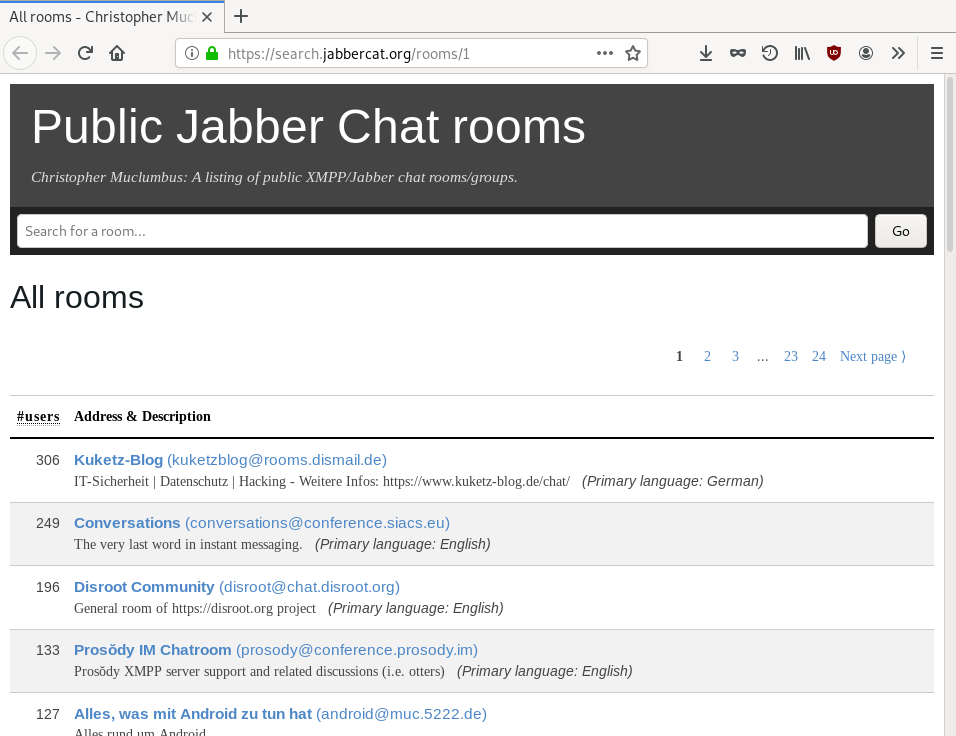

<small><a href="https://search.jabbercat.org">search.jabbercat.org</a></small>

Note:
* To me one of the coolest projects that emerged in the last year.
* Crawls a vast number of servers and generates a list of public chat rooms
* if you are new to xmpp and don’t have someone to talk there that's one way to find someone
* Also has an API that allows clients to display it directly
* Obviously centralized service that could collect IP addresses or Jabber IDs

----

#### MUC Badge


```html
<a href="xmpp:xsf@muc.xmpp.org?join">

</a>
```

Note:
* Nice badge to link from your website to a group chat

----

#### Status Monitor


```html

```

Note: While we are on the topic of badges; If you operate a public XMPP server here is another badge you can stick on your website.
Generated from information on status.conversations.im - needs to have credentials to log in.

----

#### XEP-0412: XMPP Compliance Suites 2019

* Successor to XEP-0387 (2018), XEP-0375 (2016)
* Profiles for Core, Web, IM
* Profiles for Server and Client

Note: One of the arguments you hear against XMPP is that there are too many extensions and as an implementor you don’t know what to implement and as a user you don’t know what client to download. And there is certainly some truth to that. We currently have more than 400 extensions.

So for a while we have had the so called compliance suites which are basically meant for developers to tell them 'implement these 10 extensions and everything will be fine'.
There are also different profiles. For example a web client might need to implement a slightly different set of extensions than a mobile client.

----

#### Compliance Suites Badges - Design Competition

<p></p>

<p></p>

Note: Recently we made some efforts to also expose that information to end users. A client that is compliant can show a badge to their users; and then users can specfically look for 'compliant clients'. Sort of like a 'seal of approval'. Idealy this will also act as an incentive for developers to implement the compliance.

Currently there is a design competition going on on how that 'seal of approval' might look like.

----

#### Compliance Suites Badges - Tools

Self-Assessment: [https://bitbucket.org/mrtedd/compliance-badges/](https://bitbucket.org/mrtedd/compliance-badges/src/default/)

Note: So as a client developer you either know if you implement one of the profiles of the compliance suite or you could for example do a self assesment test where you basically check of all extensions that you implement and then it will tell you what profile that is.

----

#### Compliance Suites - DOAP

* XML/RDF vocabulary
* [github.com/ewilderj/doap](https://github.com/ewilderj/doap)
* Files for [poezio](https://lab.louiz.org/poezio/poezio/blob/master/data/doap.xml), Dino,  Movim
* During Sprint in Lyon ([blog post](https://bouah.net/2019/07/new-sprint-new-goodies/#doap-description-of-a-project))

Note: Or even better: You put all the extensions into a special XML file together with some additional information about your project. And then the xmpp.org website that lists different clients could automaticlly determine that.

But can also be used in reverse; When viewing a XEP you could see what software implements it.

----

#### Provider Compliance


<small><a href="https://compliance.conversations.im">compliance.conversations.im</a></small>

Note: The vast majority of server software is 'compliant'. So this is more of a test on wether or not your (public) server is configured correctly. Email notification service; Direct access to help if something is missing

----

### Unified UX

* ›[Modern XMPP](https://docs.modernxmpp.org/)‹
* UX Sprint in Brussels before XSF Summit
* Common Language / Nomenclature
* [XEP-0392: Consistent Color Generation](https://xmpp.org/extensions/xep-0392.html)

Note:
Recently there have been some attempts to unify the UX across different clients. This doesn’t mean having the same UI in every client but at least use some common vocabulary. For example what to call a group chat or even what to call the Jabber ID or XMPP address.
There is also a neat XEP called consistent color generation which causes the same user to be displayed in the same color on different clients. For example my friend Peter has a red avatar on Conversations and also a red avatar on Dino.

----

### Growing the community

Note: Growing the community twofold. On one hand we obviously want to attract more users but on the other hand we also desperately need more developers. A vast majority of developers only work part time on XMPP; and we need to componsate for that by getting more developers.

----

#### Growing the community - Getting more users

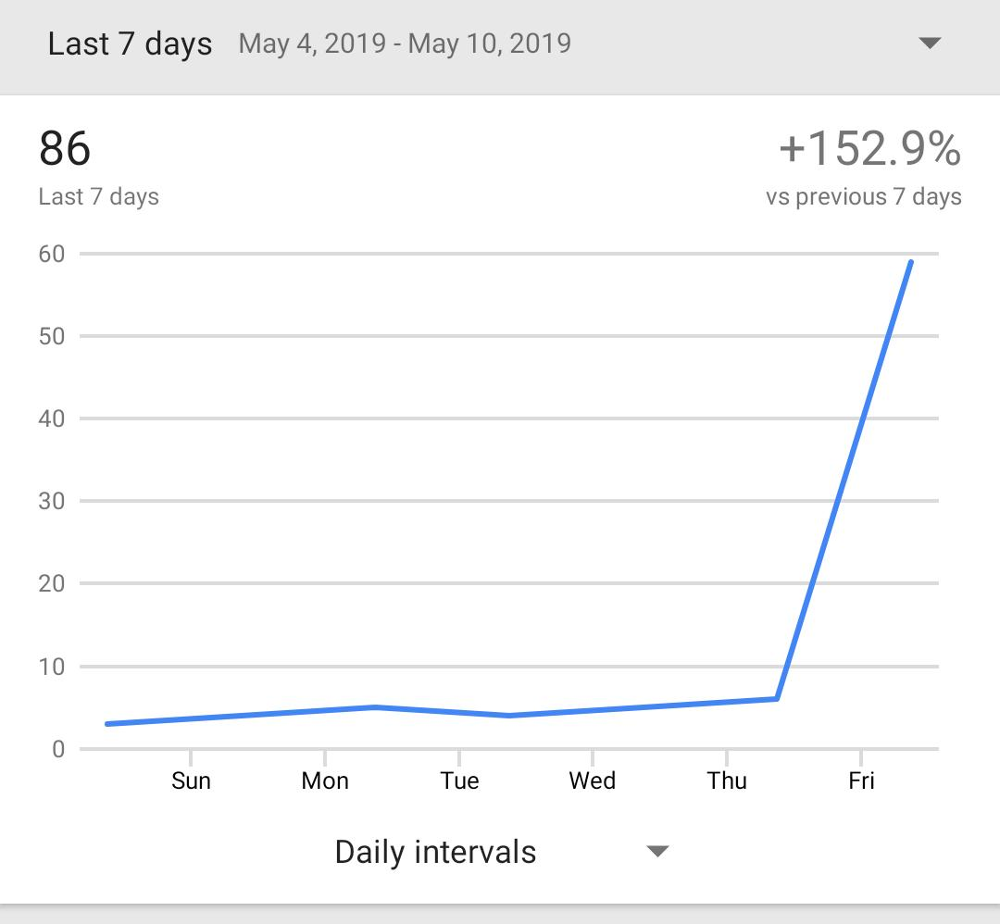

Note: Growing the user base is simple but not easy. We need to spread the word. Get media to talk about us. for example here is the graph of Quicksy downloads after it was mentioned in a German print magazine.

This also ties back to the beginning of the talk and is I believe the reason why Conversations is significantly more succesful in Germany. Because we were able to get some news coverage here.

----

#### Growing the community - Getting more developers

* Developer documentation (My first bot, …)
* Google Summer of Code
* Sprints
* Compliance Suites

Note: We have also recognized that we need to get more developer. Proper companies have dedicated people so called 'developer advocates' for that. To go to every conference in the world and tell everyone that their tool is the best. And also to write documentation. We have to do all that ourselves.
However we have identified the need for it and are trying to set some time aside to do all that.

---

## Commercial Usage

Note: Talking about commercial usage of XMPP is always a bit challenging because people are often oddly secretive about things and I'm usually under an NDA for most of the time. So it's usually easier for me to talk about other peoples project’s. However I still want to try to find some examples.

----

### Commercial Customers

* Healthcare
* NATO + Three-Letter Agencies
* Gaming
* Fashion
* Walled garden ›WhatsApp alternatives‹

Note: A funny example I learned about recently is that a fashion label was using it. Because apparently when you buy expensive fashion these days you are not doing it in a store or in an online store but on Instagram and Snapchat or what ever. And then they were using XMPP to funnel all that communication from different channels into their back end.

Also NATO, and a lot of goverment agencies are using XMPP. Usually they use special clients from companies that specifically cater to that market. And those clients then have special features like marking a message as 'top secret' or 'only for Germany' and then they have special XMPP firewalls that sit in between the UK army and the German army for example and filter based on that criteria.
But I've also know of at least an intelligence agency that uses vanilla Conversations with vanilla ejabberd.

----

### Benefits for the ›Open Source Community‹

* Servers backed by companies: ejabberd, MongooseIM, Tigase
* Knowledge transfer

---

## Clients

<small>(Projects I find interesting. Not necessarily recommendations.)</small>

----

### Converse.js

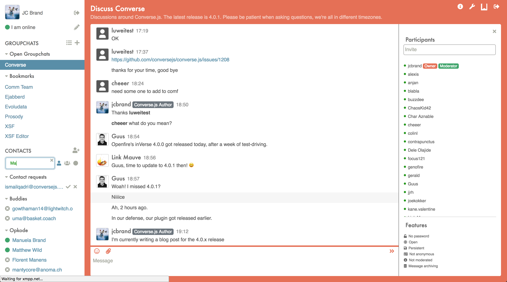

Note:
* Not just the best web client but also one of the best clients overall
* Fairly active development. Two major releases and countless minor and bug fix releases in the last 12 months.
* Last year the developer worked full time on that. Now he has a job where he is allowed to also work on Converse
* Last year: OMEMO support / HTTP Upload
* Now in latest version from this week it good stream managment support which means one can use the more efficient WebSockets instead of BOSH.

----

### Movim

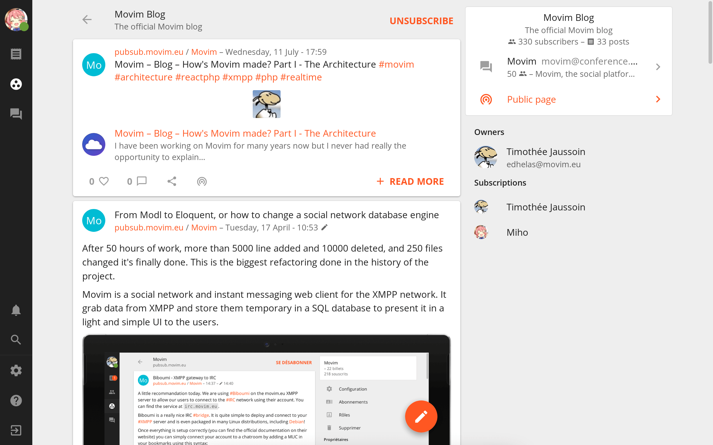

Note:
* More of Social Network with Chat capabilities.
* One if the first if not the first that support emoji reactions which is currently the new hotness in the XMPP community (but also more difficult to implement properly than one might think)
* Interesting because we don’t have a lot of web clients
* Requires PHP backend that proxies and caches things

----

### Dino

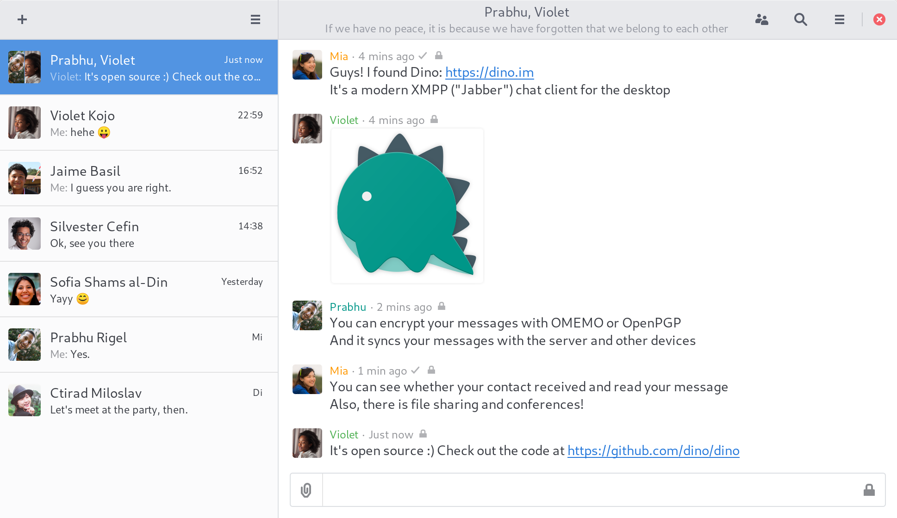

Note:
* Uses GTK and is platform independend on paper.
* Got OMEMO and HTTP Upload about a year ago. Also has support for PGP (one of the few 'modern' clients that do)
* Progress slow but steady. A google summer of code student is currently working on Jingle File Transfer support
* One of the few good desktop clients, my daily driver; No release yet which is supper annoying for people not comfortable compiling it themselves (especially Mac OS and Windows users)
* Very clean UI; all the basic features so people flock to it

----

### Gajim

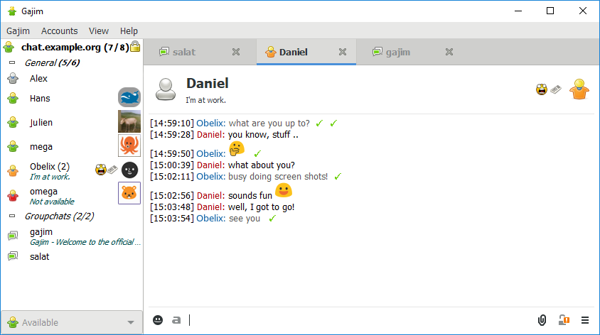

Note:
* Polar opposite to Dino. Has all XMPP features. All of them!
* In parts cluttered UI; code base partially a mess; Pretty old client; Current maintainer is the third maintainer I believe
* However maintainer is working on cleaning up the UI and the code base; it's actively being worked on. Very involved in the community and interested in supporting new things. Current master branch for example has support for MUC search.
* I'm a bit afraid it might be difficult to shake of the preconception of 'cluttered UI' even if it will improve in the future.

----

### poezio

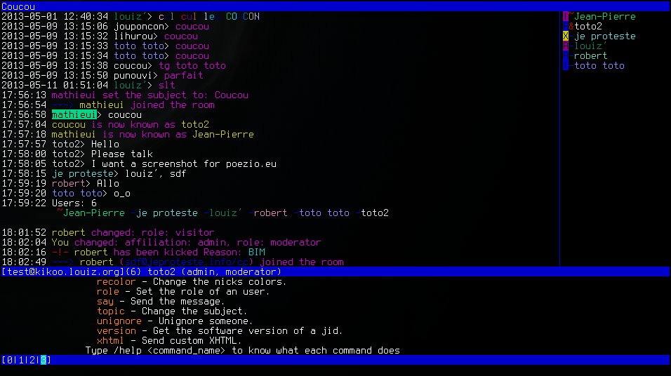

Note:
* The Gajim of text UIs. Plugins for almost everything except omemo. (it is in the works)
* But has plugins for http upload, reactions and stuff
* Pretty easy to write plugins because the client is written in python. Plugins like code highlighting or render avatars ascii art
* Kinda the prosody of clients. Easy to prototype things

----

### profanity

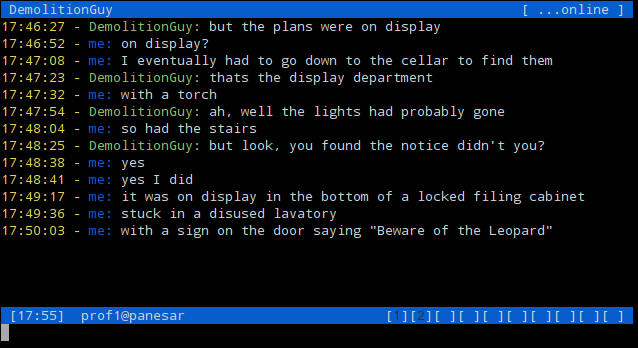

Note:
* Another text UI
* Noteworthy because it just recently got support for OMEMO
* HTTP upload support has been there for a while

----

### UWPX

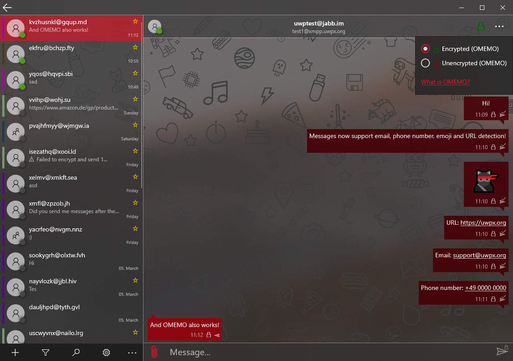


Note:
* Interesting because usually Windows support is a second class citizen and this is a dedicated Windows client.
* Uses the UWP toolkit which allows you to use the same client on every Windows platform including the Xbox and Windows phones; only that Microsoft has stopped making those.
* Interesting because it already has some basic OMEMO but no HTTP Upload, no Stream Managment no MAM
* So very alpha

----

### Kaidan

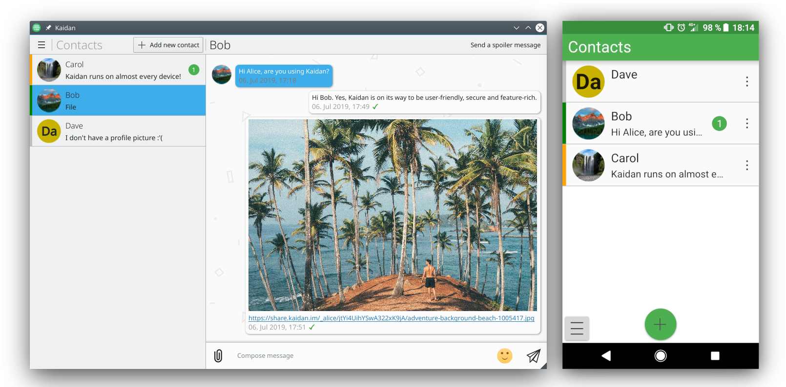

Note:
* Interesting concept. Uses Qt and KDE’s Kirigami to be truly platform independend.
* Doesn’t really feel native on Android. For example file / image picker bundles file browser that can only read internal files. Doesn’t stay connected. (**Update:** Developer says its possible to switch to the native file chooser; and staying in background is possible as well; We can expect this to be fixed in upcoming versions.)
* Supports HTTP Upload. No Group Chats nor OMEMO. Both of which are planned though.

----

### ChatSecure

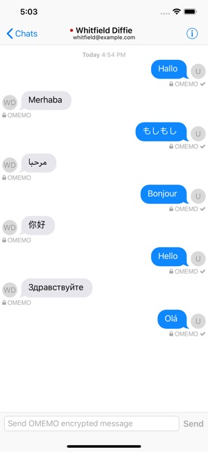

Note:
* Not much happened in the last year
* Couple of maintenance releases
* Working on porting it to MacOS via »Project Catalyst«
* Still probably the best option you have on iOS. Supports HTTP Upload and OMEMO

----

### Monal

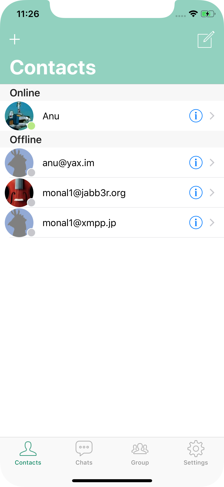

Note: 
* Has been around for a while but wasn’t very active for quite some time.
* Pace has increased lately. Has OMEMO and HTTP Upload

----

### Conversations

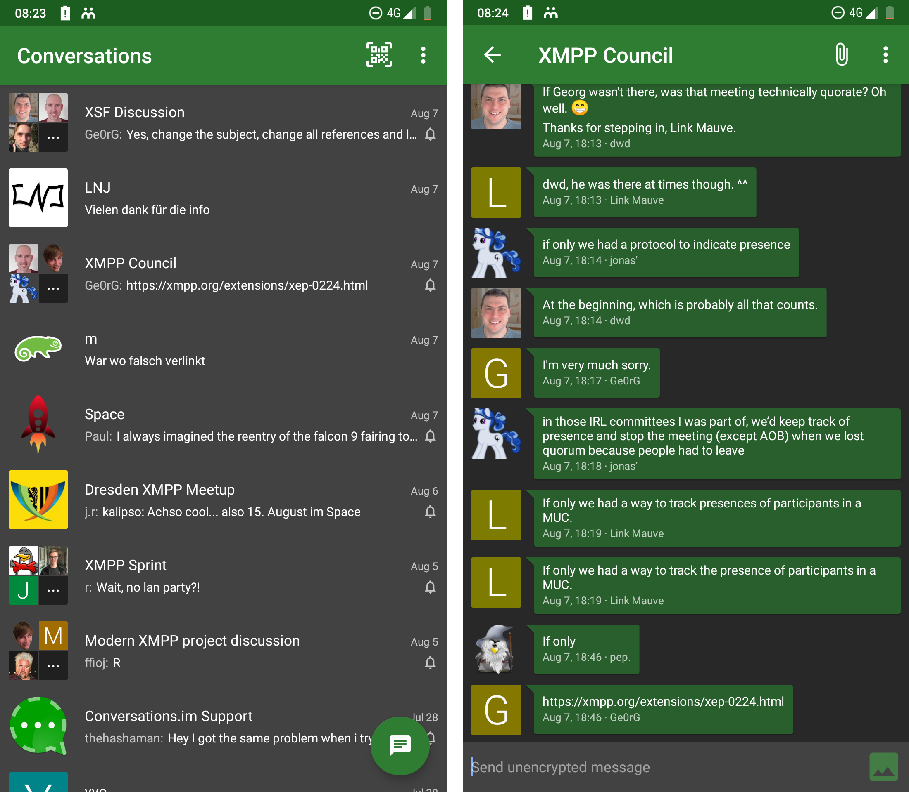

Note:
* For the most part of 2019 focused on stability rather than chasing new features.
* Incorparate changes from the 'UX Sprint' / Added support for MUC search
* Support for Backups

----

### Conversations - Roadmap to 3.0

* VoIP (Jingle)
* Massive refactor (AndroidX + Jetpack)
* Rich messages
  - Quotes
  - Website previews
  - Emoji Reactions
* Image viewer

Note: No timeline. Just plans for the future. However I have secured funding for for VoIP; and this is going to be the next thing I’ll be working on.

----

### Quicksy

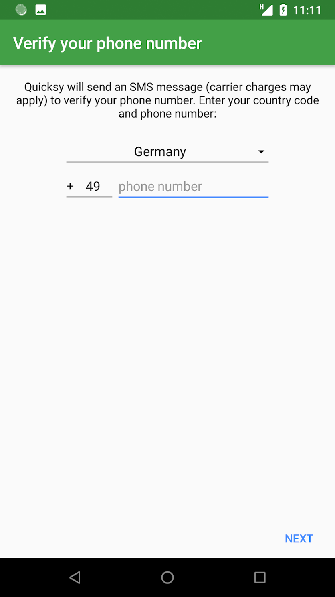

Notes:
* Spin-off of Conversations. Not a fork, developed in the same source tree
* Onboarding with phone number; automatically finds other Quicksy users based on phone numbers in your address book
* Can also chat with regular XMPP users; Quicksy users can manually add XMPP Addresses
* **Or** other XMPP users can add Quicksy users by adding *phonenumber*@quicksy.im.
* **Or** to make it even easier regular users can add their XMPP address and phone number combination into the so called *Quicksy Directory* and enable quicksy users to find them.
* *Conversations for you Quicksy for your non-nerd friends*

----

### Quicksy Directory

Enter your number for free with code: FrOSCon

[quicksy.im/enter/](https://quicksy.im/enter/)

----

### Tigase

* Anroid: Stork
* iOS: Siskin IM
* MacOS: BeagleIM

Note:
* Formerly known as Tigase Messenger. Could have been interesting because single brand à la 'Just download tigase messenger' instead of 'on iOS you have to download x on Android you have to download y'
* Naming was too confusing because vastly different feature set
* apparently very little incentive for feature parity because: 
* Server manufacturer creating tech demos for potential customers
* Siskin (iOS) and Beagle (MacOS) probably most interesting because it is the most feature complete (HTTP Upload, OMEMO, VoIP) and also the competition isn’t really good either.

----

### Xabber

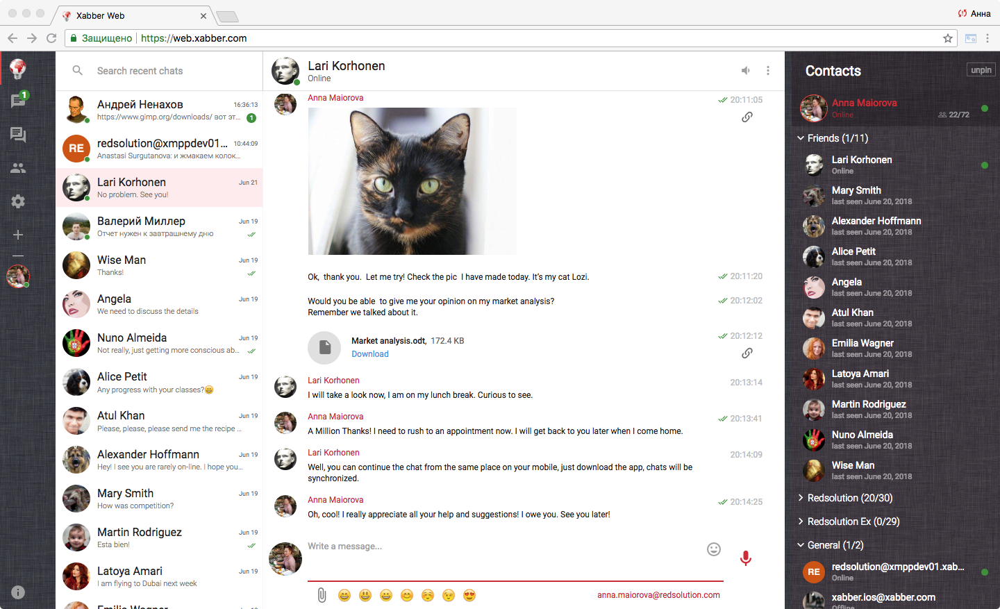

Note:
* Client for iOS in the work (closed beta, no public source code)
* Web client available
* Another contender at the unified brand across plattforms
* A bit worrysome because they don’t like MUC; they don’t like stream managment

---

## Lessons learned

----

### Jinge File Transfer vs HTTP Upload

* **Jingle FT:** Gajim, Conversations, Swift, Dino (WIP), Psi (unreleased)
* **HTTP Upload:** Converse.js, Movim, Dino, Gajim, poezio, profanity, Kaidan, ChatSecure, Monal, Conversations, Siskin, Xabber, Yaxim, JSXC, Psi (unrleased)


Note: Jingle is a fairly complex protocol to negotiate peer to peer sessions. It can be used to negoite VoIP sessions; but also to transfer files. Everything that can be send peer to peer essentially. It very power full but also very complex; in a way it is a protocol within a protocol.
People love it; because in theory you can use that to send large files between people and the server is not involved at all. 
However due to its complexity it only has three finished implementations. And every time I did interop testing with another implementation I discovered new bugs on at least on side.
On the other hand you have simple things like HTTP File upload where the file is not exchanged directly but temporarly stored on the XMPP server. And it gets the job done; and anyone can implement that in an afternoon.

----

### OMEMO

Converse.js, Dino, Gajim, profanity, ChatSecure, Monal, Conversations, Siskin, Psi, UWPX (very alpha)

<small>Are we OMEMO yet? [omemo.top](https://omemo.top/)</small>

Note: OMEMO is a fairly complicated extension as well that is widely implemented. Some clients like UWPX even give it a higher priority than some other essential extensions. However there isn’t a good alternative available. And end users really really want it. So even if it is far from a perfect extension it will get implemented.

---

## Questions?

<small>Website: [gultsch.de](https://gultsch.de) · Twitter: [@iNPUTmice](https://twitter.com/inputmice)</small>
